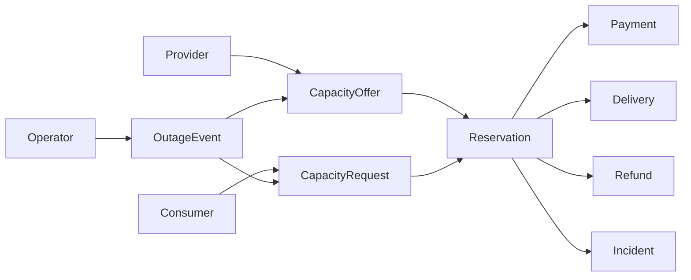
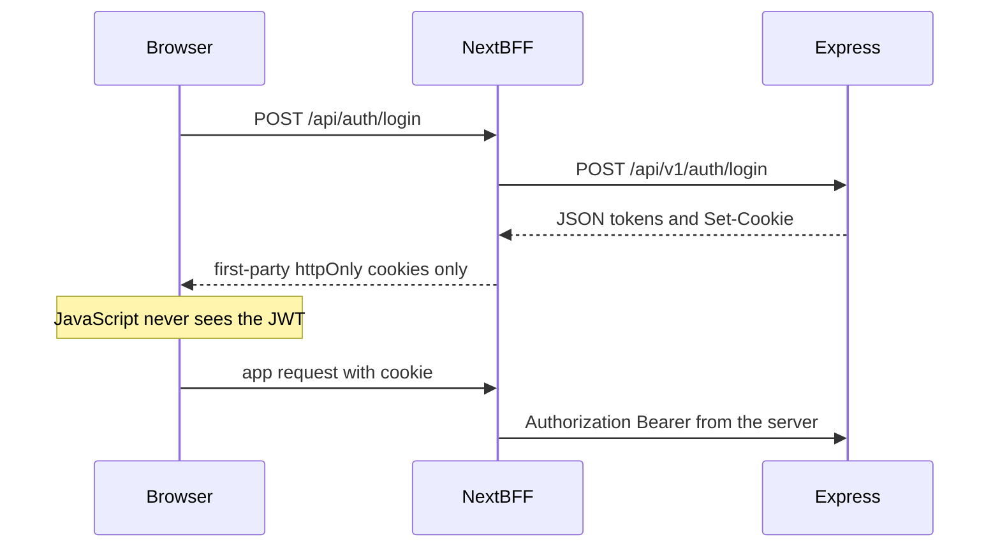

# PowerMesh Frontend Plan

This is the canonical frontend architecture. It records what the backend actually does, the decisions for the Next.js app, and the gaps that must stay visible.

Labels used below:

- **Fact** — confirmed in `power-mesh-server` source, schema, or server docs that match that source.
- **Decision** — chosen frontend approach. Also recorded in `FRONTEND_DECISIONS.md`.
- **Assumption** — not verified at runtime (for example, that a local Postgres is already migrated). Do not treat assumptions as API behavior.
- **Blocker** — a backend gap that stops a behavior. Do not fake it.
- **Future** — explicitly out of scope until the API grows.

## Authority

**Fact.** The live server is authoritative:

- `../power-mesh-server/src`
- `../power-mesh-server/prisma/schema`

Use `../power-mesh-server/README.md`, `API_TEST_FLOW.md`, `VIDEO_GUIDE.md`, `PowerMesh-mvp.html`, and `PowerMesh-Server.postman_collection.json` when they match the code.

**Fact.** These are stale assignment drafts and lose on conflict: `../files/`, `../prisma-schema.prisma`. They describe SSLCommerz, three roles, service zones, and standing offers. The running schema and routers do not.

**Decision.** See ADR-010. If a screen needs data the routes do not return, the task is `BLOCKED`.

## Workspace

**Fact.** `power-mesh-server` is Express 5, TypeScript, Prisma 7, PostgreSQL, Redis, Zod, bKash, Nodemailer, and Cloudinary. The API base is `/api/v1`. A Postman collection and a step-by-step API test flow exist.

**Fact.** This repository (`power-mesh-client`) holds the frontend docs. The Next.js app is not scaffolded yet. Phase 0 adds it at this repository root, not in a nested `frontend/` folder.

**Fact.** A populated server `.env` exists. The frontend must never read it. Only public values go in `NEXT_PUBLIC_*`.

## Backend shape

**Fact.** `../power-mesh-server/src/app.ts` mounts routers, Helmet, CORS (`origin: FRONTEND_URL`, `credentials: true`), a global limit of 200 requests / 15 minutes / IP, and a 30 / 15 minute limit on `/api/v1/auth`, `/api/v1/provider`, and `/api/v1/payments`.

**Fact.** Success envelope (`src/utils/sendResponse.ts`):

```json
{ "success": true, "statusCode": 200, "message": "...", "data": {}, "meta": { "page": 1, "limit": 10, "total": 0, "totalPages": 0 } }
```

`meta` is omitted when undefined. Lists put the array in `data`.

**Fact.** Errors (`src/app/middleware/globalErrorHandler.ts`):

```json
{ "success": false, "message": "...", "errors": ["..."] }
```

There is no application error code. Zod body failures return 400 and the first issue message. Prisma unique violations (`P2002`) return 409. Missing related rows (`P2003`) return 400. Missing records (`P2025`) return 404. Unknown routes return 404. Rate limits return 429. Auth failures are 401 ("not logged in") or 403 (wrong role, or `status === BLOCKED`). bKash initiate or execute failures return 502. `GET /api/health` is outside the envelope: `{ status, timestamp }`.

**Fact.** Zod validation runs on JSON bodies only (`src/app/middleware/validation.ts`). Several query and path Zod schemas exist and are not mounted. `sortBy` is passed through to Prisma with no allow-list.

**Fact.** Modules: `auth`, `user`, `provider`, `offer`, `event`, `capacity-request`, `reservation`, `payment`, `delivery`, `admin`.

## Authentication

**Fact.** Consumer registration does not create the user. `POST /api/v1/auth/register` stores a 6-digit OTP and the pending payload in Redis for 5 minutes. `POST /api/v1/auth/verify-email` creates `role: CONSUMER` and a consumer profile, then issues tokens. The client cannot choose a role. Names are 3–10 characters. Password is at least 8 characters and must include a lower-case letter, an upper-case letter, a digit, and a symbol. Optional nested `consumer` fields may be omitted.

**Fact.** If email fails and `EMAIL_FAIL_OPEN` is not the string `"false"` (it is unset in the checked server env, so fail-open is on), the response includes `data.otp`. **Blocker for secrecy, not for UI:** the verify screen may display a returned OTP in development and must not write it to logs.

**Fact.** Provider signup is separate: `POST /api/v1/provider/apply-as-provider` then `POST /api/v1/provider/verify-email`. Names are 3–50 characters. The provider row is created as `PENDING_APPROVAL`, and tokens are issued before an admin approves the company. One user cannot be both consumer and provider.

**Fact.** `POST /api/v1/auth/login` accepts any role that has a password. It rejects unknown users, `BLOCKED`, `DELETED` / `isDeleted`, and Google-only accounts. It does not check `emailVerified`. It does not set `lastLoginAt`. JWT payload is `{ userId, name, email, role }`. Example lifetimes in `.env.example` are access `1d` and refresh `7d`. Cookie max ages are hardcoded to 1 day and 7 days, independent of those env strings.

**Fact.** `POST /api/v1/auth/google-login` takes `{ idToken }`, verifies it against `GOOGLE_CLIENT_ID`, and creates or links a consumer. An existing user with another role is 403. A brand-new Google user can be stored with `emailVerified` still false.

**Fact.** `POST /api/v1/auth/refresh-token` reads the `refreshToken` cookie or `{ refreshToken }` and returns a new pair. There is no refresh-token store and no revocation list.

**Fact.** `POST /api/v1/auth/logout` is public. It clears cookies without repeating `sameSite`, `secure`, or `path`.

**Fact.** Cookie flags in `src/modules/auth/auth.controller.ts` and provider verify: `httpOnly: true`, `secure: false`, `sameSite: "none"`. The same handlers also put `accessToken` and `refreshToken` in `data`. **Blocker for using the API cookies in a browser:** `SameSite=None` without `Secure` is rejected, so those cookies are dropped. Storing the JSON tokens in `localStorage` is an XSS exposure. **Decision:** the BFF in ADR-004 and ADR-005. Password reset, password change, and OTP resend do not exist (`BX-01`, `BX-02`).

**Fact.** `src/app/middleware/checkAuth.ts` reads the access cookie, then `Authorization: Bearer`, then a raw `Authorization` value. It verifies the access secret, checks that the JWT role is allowed, loads the user, and rejects only `status === BLOCKED`. It does not reject `DELETED` or `isActive: false`. The role on the request is the JWT role, not the database role.

**Decision.** Session profile is `GET /api/v1/users/me` (consumer, provider, and operator includes). `GET /api/v1/auth/me` includes only `consumer`.

## Authorization

**Fact.** The only route guard is `auth(...roles)`. Ownership is checked inside some services and missing on others.

| Area | Consumer | Provider | Operator | Admin |
| --- | --- | --- | --- | --- |
| Register / apply / login / Google / refresh / logout | public | public | public | public |
| `GET/PATCH /users/me`, avatar | yes | yes | yes | yes |
| Available events and event detail | yes | yes | yes | yes |
| Create and update own events | no | no | yes, owner | no |
| List all events | no | no | yes | yes |
| Create and edit own offers | no | yes, and create requires `APPROVED` | no | no |
| Offers for an event | yes | no | yes | yes |
| Offer by id | no | yes | yes | yes |
| Own requests | yes | no | no | no |
| List all requests | no | no | yes | yes |
| Create and cancel own reservations | yes | no | no | no |
| Reservations for a provider id | no | yes | yes | yes |
| Reservation by id | yes, no ownership check | yes, no ownership check | yes | yes |
| Initiate payment, my payments | yes | no | no | no |
| All payments | no | no | yes | yes |
| Payment by id | own row | any row | yes | yes |
| Delivery check-in and kW report | no | own reservation | no | no |
| Delivery confirm and dispute | own reservation | no | no | no |
| Approve or reject providers | no | no | yes | yes |
| Allocation preview, approve, reservation status override | no | no | yes | yes |
| Overview, users, block, soft-delete, audit, dashboard stats | no | no | no | yes |

**Fact.** Admin cannot block or soft-delete another admin. Soft-delete sets `isDeleted`, `deletedAt`, `status: DELETED`, and `isActive: false`. Later requests still pass `checkAuth` for a deleted user because only `BLOCKED` is rejected.

**Decision.** ADR-006. Navigation hides actions the table forbids. Middleware redirects to the role home. Express remains the authority (ADR-004).

## Domain

**Fact.** `User.role` is exactly one of `PROVIDER | CONSUMER | OPERATOR | ADMIN`. Profiles are optional 1:1 rows, not extra roles. Seeded admin is `User.role = ADMIN` plus an operator row with `isAdmin: true`. The JWT role is still `ADMIN`, so operator-only routes reject that user.



**Fact.**

- Events are not anonymous. `GET /event/available` requires one of the four roles and returns `SCHEDULED` or `CONFIRMED` events whose `scheduledEnd` is still in the future.
- Offers require `eventId`. No standing offers. Unique on provider, event, and delivery window. `capacityKw` cannot exceed the provider's `capacityKw`.
- One `CapacityRequest` per `(consumerId, eventId)`, including after cancel. A second insert hits the unique constraint (409). Statuses `REJECTED` and `FULFILLED` are never written.
- Allocation (admin service) sorts pending requests by priority tier then `createdAt`, and offers by price then `deliveryStart`. A request matches only when one offer has enough remaining kW and `pricePerKwh` is at most `maxPricePerKwh`. The whole request is allocated or skipped. `survivalQuotaKw` is validated on create (`<= totalCapacityKw`) and not used by allocation.
- `POST /reservation/create` is a second path. It does not increment `OutageEvent.allocatedKw` and does not check price or event status.
- Normal reservation path: `ALLOCATED` → pay initiate → `PAYMENT_PENDING` → callback success → `PAYMENT_COMPLETED` → provider check-in → `DELIVERY_PENDING` → consumer confirm → `DELIVERY_CONFIRMED` or shortfall `DELIVERY_PARTIAL`. A failed or cancelled bKash callback sets the reservation back to `ALLOCATED` and payment status `FAILED`.
- Consumer cancel is allowed only from `ALLOCATED` or `PAYMENT_PENDING`.
- Delivery mutations require reservation `PAYMENT_COMPLETED` or `DELIVERY_PENDING`. Confirm requires a delivered-kW report. Shortfall writes delivery `PARTIAL`, an `OPEN` incident `PARTIAL_DELIVERY`, and a local `Refund` (`shortageKw * unitPrice`) without calling bKash and without changing payment status. Dispute sets delivery `DISPUTED` and does not change reservation status.
- Admin or operator override accepts any `ReservationStatus` with optional `paymentStatus` and `resolution`. `FAILED` or `REFUNDED` writes a full refund, tries `bkash.refundPayment` only when `gatewayId` and `bkashTrxId` exist, and still writes the local row if the gateway errors. `CANCELLED` releases capacity only when there is no payment row.
- `Rating` has no module. Most incident enum values are never written. No incident routes. `GRID_STAYED_ON` and `OTHER` are unused. There is no 60-minute pay window, re-offer, cancellation fee, platform fee, or provider payout. `bankAccountNumber` is stored only.

Event transitions an operator may send: `SCHEDULED` → `CONFIRMED` or `CANCELLED`; `CONFIRMED` → `IN_PROGRESS` or `CANCELLED`; `IN_PROGRESS` → `COMPLETED`. `COMPLETED` and `CANCELLED` are terminal. Soft-delete is only from `SCHEDULED` with no active offers or pending/allocated requests, and it sets `CANCELLED`.

Offer update is allowed only from `AVAILABLE` or `PARTIALLY_AVAILABLE`, but the update body may set any offer status. `EXPIRED` is never set by a job.

## API map

**Fact.** Base path `/api/v1`. Default list query when the service reads it: `page=1`, `limit=10`, `sortBy=createdAt`, `sortOrder=desc`. Available events default to `scheduledStart` ascending. Requests-by-event default sort is `priorityTier` ascending.

### Auth `/api/v1/auth`

| Method | Path | Auth | Body | Result |
| --- | --- | --- | --- | --- |
| POST | `/register` | public | consumer register schema | 201 OTP pending, `{ emailSent, otp? }` |
| POST | `/verify-email` | public | email, otp length 6 | 201 tokens, user, consumer |
| POST | `/login` | public | email, password | 200 tokens |
| POST | `/google-login` | public | `{ idToken }` | 200 tokens |
| POST | `/refresh-token` | public | cookie or `{ refreshToken? }` | 200 new pair |
| POST | `/logout` | public | none | 200, cookies cleared |
| GET | `/me` | any role | none | user with consumer only |

### Users `/api/v1/users` — any role

- `GET /me` — user without password, includes consumer, provider, operator.
- `PATCH /me` — optional `firstName`, `lastName`, `imageUrl`, nested consumer and provider strings. No name length limits on this schema.
- `PATCH /me/profile-picture` — multipart field `profilePicture` (JPEG, PNG, WEBP, AVIF).

### Provider `/api/v1/provider`

- `POST /apply-as-provider` public. Company, unique license, `resourceType` (`GENERATOR | SOLAR_BESS | BATTERY | MICROGRID | OTHER`), positive integer `capacityKw`, address, contact person, phone. Optional bank account.
- `POST /verify-email` public.
- `PATCH /approve-provider`, `PATCH /reject-provider` — `ADMIN` or `OPERATOR`. Reject reason 3–500 characters.
- `GET /all-providers`, `GET /:id` — `ADMIN` or `OPERATOR`. **Blocker:** the list reads `page` and `limit` without applying skip, so it is not paged (`BX-08`).

### Events `/api/v1/event`

- Create, update, status, soft-delete, `GET /my-events` — `OPERATOR` only, owner for mutations.
- `GET /all` — `ADMIN`, `OPERATOR`.
- `GET /available`, `GET /:id` — any role.

### Offers `/api/v1/offer`

- Create, update, soft-delete, `GET /my-offers` — `PROVIDER`. Create requires `Provider.status === APPROVED`, positive price, and `deliveryEnd` after `deliveryStart`.
- `GET /all` — `ADMIN`, `OPERATOR`.
- `GET /event/:eventId` — `ADMIN`, `OPERATOR`, `CONSUMER`.
- `GET /:id` — `ADMIN`, `OPERATOR`, `PROVIDER`.

### Requests `/api/v1/request`

- Create, update, cancel, soft-delete, `GET /my-requests` — `CONSUMER`. Create only while the event is `SCHEDULED` or `CONFIRMED`. Update and cancel only while `PENDING`. Priority is `CRITICAL | HIGH | MEDIUM | LOW | FLEXIBLE`.
- `GET /all` — `ADMIN`, `OPERATOR`.
- `GET /event/:eventId`, `GET /:id` — `ADMIN`, `OPERATOR`, `CONSUMER`.

### Reservations `/api/v1/reservation`

- `POST /create` — `CONSUMER`, `{ offerId, requestId }`, status `ALLOCATED`.
- `GET /my-reservations`, `PATCH /cancel/:id` — `CONSUMER`.
- `GET /provider/:providerId` — `PROVIDER`, `ADMIN`, `OPERATOR`.
- `GET /all` — `ADMIN`, `OPERATOR`.
- `GET /:id` — any role, no ownership check.

### Payments `/api/v1/payments`

- `POST /initiate` — `CONSUMER`, `{ reservationId }`. 201 `{ payment, bkashURL, paymentID }`. Reservation must be owned and `ALLOCATED` or `PAYMENT_PENDING`.
- `GET /callback` — public. No JSON. Redirects the browser.
- `GET /my-payments` — `CONSUMER`.
- `GET /all` — `ADMIN`, `OPERATOR`.
- `GET /:id` — any role; consumer rows are scoped to the caller; provider rows are not.

### Delivery `/api/v1/delivery`

- `GET /:reservationId` — any role; consumer and provider must own it.
- `POST /:reservationId/provider-check-in`, `POST /:reservationId/provider-report` with `{ actualDeliveredKw }` integer ≥ 0 — `PROVIDER`.
- `POST /:reservationId/consumer-confirm`, `POST /:reservationId/consumer-dispute` with `{ disputeReason }` min 5 — `CONSUMER`.

### Admin `/api/v1/admin`

- `ADMIN` only: `GET /overview`, `GET /dashboard-stats`, `GET /users`, `GET /users/:id`, `PATCH /users/:id/block` `{ isBlocked, reason? }`, `PATCH /users/:id/soft-delete`, `GET /audit-logs`.
- `ADMIN` or `OPERATOR`: `POST /events/:id/allocate` (compute only), `POST /events/:id/approve-allocation` (writes reservations), `PATCH /reservations/:id/status`.

**Decision.** A shared `ListQuery` type (`page`, `limit`, `sortBy`, `sortOrder`, plus filters) is the only list-parameter shape. Do not invent filters the service does not read.

## Frontend feature map

### Public

**Decision.** Marketing home, login, consumer registration and OTP verify, provider application and OTP verify, Google consumer login.

Supporting: show `message` and `errors[0]`; show 429 copy; show `otp` only when the register response includes it.

**Fact.** Anonymous event browsing, password reset, and a role picker on one signup are not available.

### Consumer

**Decision.** Available events, offers on an event, one request per event, reservation create and cancel, bKash pay, payment history, delivery confirm and dispute, profile and photo.

Supporting: status badges, empty state when no offer fits, a banner when the unique request slot is already used (including after cancel).

**Future / blocker.** 60-minute pay window, automatic re-offer, cancellation fee, ratings, wallet, zones. Do not build them (`BX-03`, `BX-05`).

### Provider

**Decision.** Show approval status from `GET /users/me`. Block offer create until `APPROVED`. Then my offers, create, update, soft-delete, reservations for the provider id, check-in, delivered-kW report, profile.

**Blocker.** The seeded provider cannot create an offer until an operator or admin approves them (`BX-07`). The UI shows the pending state. It does not mark the account approved locally.

**Future.** Payouts, reliability score, standing offers.

### Operator

**Decision.** Own events (create, update, status, soft-delete), provider approve and reject, allocation preview and a separate approve action, reservation and payment lists, reservation status override, request list.

**Fact.** Admin users who open these write screens for events receive 403. Do not put event create in the admin nav.

### Admin

**Decision.** Dashboard stats (prefer `GET /dashboard-stats` once), users, block, soft-delete, audit log, and the shared allocation, reservation override, and provider approval screens.

**Future / blocker.** Incident inbox, refund-status editor, rating moderation (`BX-04`). Stats may include incident and refund totals as read-only numbers.

### Do not build yet

Service zones, standing offers, survival-quota enforcement UI, partial-kW accept flow, ratings, SMS, IoT, dynamic pricing, platform fee, provider payouts, a chart library, password reset, SSLCommerz, Stripe.

## Rendering

**Decision.** ADR-002 and ADR-011. Pages are static Server Components. Interactivity is a client island inside the page.

- `(public)` pages, including marketing, login, and registration, are static. The page renders the heading and layout. The form or the Google button is `"use client"`.
- `(dashboard)` pages are static documents too. Middleware sends the wrong role away, so the page file does not call `cookies()` and does not opt the whole route into dynamic rendering.
- Lists, forms, pay buttons, allocation preview, and the payment-status check are Client Components mounted by those static pages. TanStack Query lives in the island that needs fresh rows. The API has no cache-tag webhook, so those islands refetch. The surrounding page does not.
- Do not mark a `page.tsx` or `layout.tsx` with `"use client"`. Do not use ISR for marketplace rows.

`loading.tsx` and `error.tsx` wrap each role segment. API errors stay inside the client island (`isError`) so a 403 does not replace the whole shell.

## Server and client components

**Decision.** ADR-002.

A `page.tsx` file is a static Server Component. It imports client pieces only for the controls that need them:

- forms (React Hook Form)
- buttons that mutate or navigate after a click
- TanStack Query lists and the payment-status check
- dialogs, toasts, table filters, sidebar toggle
- `window.location` assignment to `bkashURL`
- Google Identity Services
- the profile file input

`src/api` and `src/lib` do not import React. `src/providers` holds the Query provider, and the root layout mounts it. That provider is a client boundary. The pages under it stay server components.

## State

**Decision.** ADR-003.

| State | Where |
| --- | --- |
| Role used for navigation | middleware, then the path maps in `src/routes` |
| User profile and every API resource | TanStack Query, inside the client island that renders it |
| `page`, `limit`, `status`, `searchTerm`, `eventId`, payment `status` | URL search params |
| Dialog open, wizard step, sidebar collapsed, row selected before submit | local React state in that client component |

Query keys include scope and list params, for example `['reservations', 'mine', { page, status }]`. Mutations invalidate the specific keys they change.

Cache: `staleTime` 5 minutes for `['me']`, 60 seconds for events and offers, 15 seconds for reservations and delivery, 0 for the payment-return refetch. `refetchOnWindowFocus` is off except payment return and in-progress delivery. `gcTime` 10 minutes.

There is no Zustand store and no `store/` directory. Do not put JWTs, OTPs, payment payloads, or server lists in module scope.

## Security

**Fact.** See the cookie and token notes under Authentication.

**Decision.** ADR-004 and ADR-005.



- BFF auth routes set `accessToken` and `refreshToken` as `httpOnly`, `sameSite: "lax"`, `secure` in production, `path: /`. The JSON sent to the browser contains the user profile, not the tokens.
- Middleware checks expiry and role only to redirect. It is not authorization.
- Logout calls the API and clears the first-party cookies with the same options.
- State-changing BFF routes reject a mismatched `Origin`. `SameSite=Lax` already withholds the cookie on cross-site POST. No extra CSRF token unless cookies later move to `SameSite=None`.
- Render API messages as text. Profile images use `next/image` remote patterns.
- `NEXT_PUBLIC_GOOGLE_CLIENT_ID` is public. `GOOGLE_CLIENT_SECRET` stays on the API. The BFF forwards `idToken` only.
- The payment screen only navigates to `bkashURL` from the initiate response. It never holds `BKASH_*` and never treats `?status=success` as proof.
- Do not loop on 429. Express already sets `trust proxy` to 1.
- Frontend env: `API_URL` (server-only), `NEXT_PUBLIC_APP_URL`, `NEXT_PUBLIC_GOOGLE_CLIENT_ID`, `NEXT_PUBLIC_DEMO_LOGIN`. No database, Redis, SMTP, JWT, or bKash secrets.

**Assumption.** Local development uses the API on port 5000 and the Next app on port 3000, matching `.env.example` `FRONTEND_URL`. Confirm when scaffolding.

## Performance

**Decision.** ADR-008. Rate limits dominate.

- One `['me']` fetch inside the shell client island.
- The event client island loads event detail, offers, and the caller's request together. Do not chain them in nested effects, and do not prefetch them in the static page.
- Keep API pagination (limit 10). Do not virtualize until a screen drops paging.
- Admin home calls `dashboard-stats` once. No chart library.
- Split role routes. Load Google and the payment return module only on those routes.
- `next/font` and `next/image`.
- Debounce search on provider and payment screens (30-request limiter).

## Payment

**Fact.** The implemented provider is bKash Tokenized Checkout (`../power-mesh-server/src/app/lib/bkash.ts`, `../power-mesh-server/src/modules/payment/payment.service.ts`). Currency `BDT`. Server README, video guide, Postman, and `.env.example` agree. Stripe code is absent. SSLCommerz appears in `../files/` and the stale root schema only.

**Decision.** ADR-007. The UI implements this sequence and no other gateway:

1. `POST /api/v1/payments/initiate` with `reservationId`.
2. Navigate the browser to `data.bkashURL`.
3. bKash redirects to `GET /api/v1/payments/callback` on the API (`BKASH_CALLBACK_URL`). The API executes the payment.
4. The API redirects to `{FRONTEND_URL}/my-payments?status=success` or `?status=` plus the callback status (`cancel` or `failure`).
5. `/my-payments` refetches `GET /payments/my-payments`.

There is no webhook POST. `bkash.queryPayment` is exported and unused. Refund execution stays on `PATCH /api/v1/admin/reservations/:id/status`. Partial-delivery copy must say a refund row was recorded, not that bKash returned the money (`BX-09`).

**Conflict, unresolved by the frontend.** Assignment drafts ask for SSLCommerz, and some lines also allow Stripe or bKash. Building SSLCommerz would call an API that does not exist. The frontend follows bKash. The draft text stays in `files/` unchanged.

## Demo login

**Fact.** Development seeds, documented in the server README, `VIDEO_GUIDE.md`, `API_TEST_FLOW.md`, and `.env.example`:

| Role | Email | Password |
| --- | --- | --- |
| Admin | `admin@powermesh.com` | `Admin@123` |
| Operator | `operator@powermesh.com` | `Operator@123` |
| Provider | `provider@powermesh.com` | `Provider@123` |
| Consumer | `consumer@powermesh.com` | `Consumer@123` |

`server.ts` seeds when `NODE_ENV=development` or `RUN_SEEDS=true`. Passwords come from `SEED_*` env vars. These are development accounts.

**Blocker.** `../power-mesh-server/src/utils/seed.ts` sets the provider `verified: true` and does not set `status`, so the default remains `PENDING_EMAIL_VERIFICATION`. `createOffer` requires `APPROVED`. **Decision.** Demo buttons post the four accounts to the same login route and are enabled only when `NEXT_PUBLIC_DEMO_LOGIN=true`. The provider home shows the real status. Approval is an operator or admin action. The frontend does not patch the seed (`BX-07`).

## Folder structure

**Decision.** ADR-009 and ADR-011. The Next.js app is this repository. Source is under `src/`. There is no `features/` directory and no `store/` directory.

```text
src/
  api/                         # BFF modules: login, logout, refresh, proxy, envelope
  app/
    (public)/                  # marketing, login, consumer register, provider apply
      login/page.tsx
      register/page.tsx
      register/verify/page.tsx
      provider/apply/page.tsx
      provider/verify/page.tsx
    (dashboard)/
      consumer/...
      provider/...
      operator/...
      admin/...
      my-payments/page.tsx     # URL stays /my-payments
    api/                       # thin route.ts files that call src/api
      auth/login/route.ts
      auth/logout/route.ts
      auth/refresh/route.ts
      proxy/[...path]/route.ts
  assets/
  components/                  # ui, shell, states, and screen components
  hooks/
  lib/                         # session cookie helpers; no React imports
  providers/                   # Query provider
  routes/
    admin.routes.ts
    provider.routes.ts
    consumer.routes.ts
    operator.routes.ts
  types/
  utils/
  validation/                  # Zod mirrors of mounted API bodies
```

`middleware.ts` stays at the project root, which is the Next.js convention.

`src/routes` holds path, label, and role metadata for navigation. It does not replace `src/app`. `consumer.routes.ts` and `operator.routes.ts` exist because the API has four roles. Do not collapse those files into the admin or provider map.

Next.js serves route handlers only from `app/`. Implement the BFF in `src/api`, and keep `src/app/api/**/route.ts` as a short call into `src/api` so the handler still runs. There is no `services/` directory.

Shared allocation UI is a component mounted by both the operator page and the admin page. Event create stays on the operator page.

## App Router

**Decision.** ADR-001.

- `src/app/layout.tsx` — html, font, Query provider, toaster. No role logic. The file stays a Server Component. The provider and toaster are client children.
- `(public)` layout — no sidebar. Marketing, login, and registration live here. There is no `(auth)` route group.
- `(dashboard)/layout.tsx` — static shell. It does not call `cookies()`. Middleware already redirected. The sidebar toggle is a client island. Links come from `src/routes`.
- `loading.tsx` and `error.tsx` on `(dashboard)` and each role segment.
- Root `not-found.tsx`.
- Dynamic URL segments only where the API has an id: `events/[id]`, `reservations/[id]`, `admin/users/[id]`. The page file is still a Server Component. The interactive panel inside it is the client island.
- `(dashboard)/my-payments/page.tsx` is the URL `/my-payments`. The page is static. The status check is a client island.
- `middleware.ts` protects `/consumer`, `/provider`, `/operator`, `/admin`, and `/my-payments`. It sends a signed-in user away from `/login`. It does not protect `(public)` pages.

Admin event pages are read-only plus allocate. Operator event pages include create and status changes.

## Scalability

**Decision.**

- The BFF is the only browser entry from the first commit. Handler code lives in `src/api`. Switching later from stored Bearer tokens to cookies would rewrite every caller.
- Operator and admin stay separate shells and separate files under `src/routes`. Shared allocation components are mounted by both pages. Event create stays on the operator page.
- List parameters go through one `ListQuery` type in `src/types`.
- Enums live in `src/types`. Zod mirrors live in `src/validation`. A later OpenAPI generator can replace those files. No OpenAPI spec is published today.
- New screens are new pages under `src/app` plus components. They are not a new top-level feature tree.
- A later socket can invalidate `['reservations', id]` from the client island that owns that query. Do not add a socket client now.
- A second payment provider, if the API ever grows one, stays behind the payment client component so the return page URL remains `/my-payments`.

**Future.** Websockets, a workflow engine, a chart platform, and a multi-gateway adapter are not justified by the current API.

## Conflicts, gaps, and risks

| Topic | What is true | What to do |
| --- | --- | --- |
| Payment provider | bKash in the server. SSLCommerz and Stripe in `files/` and the root schema draft. | Follow bKash. Leave the drafts as history. |
| Admin vs operator | Server README says admin is everything the operator can do. Event writes are `OPERATOR` only. | Follow the routes. |
| Tokens | Cookies are `SameSite=None; Secure=false` and are also in JSON. README says "Bearer token". | BFF. Never `localStorage`. |
| Seeded provider | `verified: true`, status still `PENDING_EMAIL_VERIFICATION`. | Show pending. Do not fake approval. |
| Profile endpoint | `/auth/me` vs `/users/me`. | Use `/users/me`. |
| Name limits | Consumer register max 10. Provider apply max 50. `PATCH /users/me` has neither. | Mirror the schema of the endpoint being called. |
| Provider paging | `GET /provider/all-providers` does not page. | Render the array. Do not invent pages. |
| Ownership | `GET /reservation/:id` is open to any role. `GET /payments/:id` is not scoped for providers. | Prefer owned lists. |
| Cancelled request | Unique `(consumer, event)` remains. | Handle 409. Explain that the slot is used. |
| Allocation | Preview writes nothing. | Approve is a second action. |
| Partial refund | Local `Refund` row, no bKash call. | Honest copy. |
| Missing product routes | Password reset, ratings, incidents, zones, standing offers, pay window, fees. | Blocked tasks. No fake screens. |
| Refresh theft | Logout and refresh do not revoke the previous refresh token. | Keep tokens out of the browser. |
| OTP fail-open | OTP can be in the register response. | Display only if present. Do not log it. |
| Deleted users | `checkAuth` ignores `DELETED`. | Do not claim soft-delete is a hard session kill. |

## Implementation order

1. Next.js app under `src/`, Tailwind, shadcn, env split, typed envelope in `src/api`, BFF login / logout / refresh / proxy.
2. Middleware, role shells, `['me']`, demo login.
3. Consumer and provider registration, OTP verify, Google consumer login.
4. Profile and avatar.
5. Operator events, provider offers with the approval gate, consumer browse, request, and reservation.
6. bKash initiate and `/my-payments`.
7. Delivery check-in, report, confirm, dispute.
8. Shared allocation and reservation override.
9. Admin users, block, soft-delete, audit, dashboard stats.
10. Loading, empty, and error states, then a browser pass of each role including a cross-role URL.

Task ids and acceptance criteria are in `FRONTEND_TASKS.md`.
